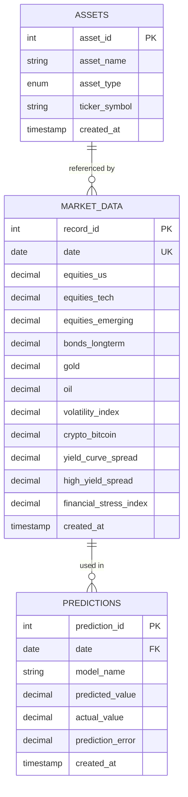

# Entity-Relationship Diagram (ERD)

## Database Schema ERD



## Relationships

1. **ASSETS → MARKET_DATA**: One-to-Many relationship
   - Each asset can have multiple market data records over time
   - Foreign key: `asset_id` in MARKET_DATA table

2. **MARKET_DATA → PREDICTIONS**: One-to-Many relationship
   - Each market data record can have multiple predictions
   - Foreign key: `date` in PREDICTIONS table

## MongoDB Collection Structure

```javascript
// Collection: market_timeseries
{
  _id: "YYYY-MM-DD",        // Date as string (unique identifier)
  date: ISODate,             // Date object
  equities: {
    us: Number,
    tech: Number,
    emerging: Number
  },
  commodities: {
    gold: Number,
    oil: Number
  },
  crypto: {
    bitcoin: Number
  },
  bonds: {
    longterm: Number
  },
  indicators: {
    volatility_index: Number,
    financial_stress_index: Number,
    yield_curve_spread: Number,
    high_yield_spread: Number
  },
  technical: {
    spy_drawdown: Number,
    spy_rsi_14: Number,
    gld_rsi_14: Number
  }
}
```

## Indexes

### MySQL Indexes
- `idx_date` on `market_data(date)`
- `idx_financial_stress` on `market_data(financial_stress_index)`
- `idx_model` on `predictions(model_name)`
- `idx_prediction_date` on `predictions(date)`

### MongoDB Indexes
- `date` (ascending) - Unique
- `indicators.financial_stress_index` (ascending)

